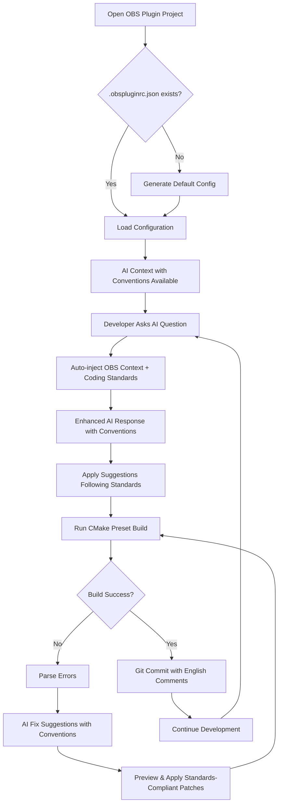

# OBS Plugin AI Assistant Extension - Product Requirements Document

## 1. Product Overview

An intelligent Trae IDE extension that automatically injects OBS plugin development context into AI interactions, eliminating repetitive prompt typing and accelerating OBS plugin development workflows.

- **Core Purpose**: Provide seamless AI assistance for OBS plugin development by automatically contextualizing AI requests with project-specific OBS configuration, build system information, and error diagnostics.
- **Target Users**: C++ developers building OBS Studio plugins who want to leverage AI assistance without manually providing context repeatedly.
- **Market Value**: Significantly reduces development friction and improves productivity for the growing OBS plugin ecosystem.

## 2. Core Features

### 2.1 User Roles

| Role | Registration Method | Core Permissions |
|------|---------------------|------------------|
| OBS Plugin Developer | Install extension in Trae IDE | Full access to all extension features including build automation, AI context injection, and error fixing |

### 2.2 Feature Module

Our OBS Plugin AI Assistant extension consists of the following main functional areas:

1. **Configuration Management**: Project-specific OBS configuration handling via .obspluginrc.json with default templates
2. **AI Context Injection**: Automatic enhancement of AI prompts with OBS development context and coding conventions
3. **Build Automation**: Integrated CMake preset-based build execution with real-time output streaming
4. **Error Analysis**: Intelligent parsing and categorization of compiler/linker errors
5. **Fix Suggestions**: AI-powered error resolution with patch generation and preview
6. **Development Tools Integration**: Seamless integration with clangd, CMake presets, and OBS plugin template structure
7. **Default Configuration Templates**: Pre-configured settings for OBS plugin development best practices

### 2.3 Page Details

| Page Name | Module Name | Feature description |
|-----------|-------------|---------------------|
| Command Palette | OBS Commands | Execute obs:configure, obs:build, obs:clean, obs:fix-error, obs:show-config, obs:init-template commands |
| Output Panel | Build Executor | Stream CMake preset build output with timestamps, display structured error information |
| Diagnostics Panel | Error Analysis | Show parsed compiler errors with clickable navigation to source files and lines |
| AI Chat Interface | Context Injection | Display AI conversations with automatically injected OBS context and coding conventions |
| Configuration Editor | Config Management | Edit .obspluginrc.json with schema validation, platform profiles, and default templates |
| Patch Preview | Fix Application | Preview AI-generated patches with apply/reject actions and git integration |
| Template Generator | Project Setup | Generate default .obspluginrc.json with OBS plugin template conventions |

## 3. Core Process

**Primary Developer Workflow:**
1. Developer opens OBS plugin project in Trae IDE (based on obs-plugintemplate)
2. Extension automatically detects or creates .obspluginrc.json with default OBS conventions
3. When asking AI questions, extension automatically injects OBS context, coding standards, and project structure
4. Developer can execute preset-based build commands (obs:build using cmake presets)
5. On build errors, developer can trigger obs:fix-error for AI-powered solutions with convention awareness
6. AI provides patches following OBS plugin coding standards
7. Developer continues development with enhanced AI assistance and automatic convention enforcement

**Error Resolution Flow:**
1. Build fails with compiler/linker errors from CMake preset execution
2. Log Parser extracts structured error information
3. Developer clicks "Fix" or runs obs:fix-error command
4. AI Middleware creates context envelope with error details, coding conventions, and relevant code snippets
5. AI returns unified diff or edit instructions following OBS plugin standards
6. Patch Generator validates and previews changes
7. Developer applies patch and re-runs preset-based build



## 4. User Interface Design

### 4.1 Design Style

- **Primary Colors**: Trae IDE theme integration with OBS brand accent (#1f2937 dark, #3b82f6 blue accents)
- **Button Style**: Rounded corners with subtle shadows, consistent with Trae IDE design language
- **Font**: Monospace for code/logs (JetBrains Mono), Sans-serif for UI text (Inter)
- **Layout Style**: Panel-based with collapsible sections, integrated into Trae's sidebar and bottom panels
- **Icons**: Feather icons with OBS-specific custom icons for build/error states

### 4.2 Page Design Overview

| Page Name | Module Name | UI Elements |
|-----------|-------------|-------------|
| Command Palette | OBS Commands | Command list with obs: prefix, keyboard shortcuts (Cmd+Shift+O), preset indicators |
| Output Panel | Build Stream | Terminal-style output with CMake preset execution logs, timestamps, collapsible sections |
| Diagnostics Panel | Error Display | Table view with severity icons, clickable file/line links, convention violation warnings |
| AI Chat | Context Injection | Chat interface with collapsible system prompt showing injected conventions |
| Config Editor | JSON Editor | Syntax-highlighted JSON editor with OBS template schema, platform preset tabs |
| Patch Preview | Diff Viewer | Side-by-side diff view with convention compliance indicators, apply/reject buttons |
| Template Setup | Project Init | Wizard interface for generating default .obspluginrc.json with OBS conventions |

### 4.3 Responsiveness

Desktop-first design optimized for development workflows. Panels are resizable and dockable within Trae IDE's layout system. Touch interaction not required as this is a desktop development tool.

## 5. Default Configuration and Conventions

### 5.1 OBS Plugin Development Conventions

The extension enforces the following coding standards by default:

**C++ Development Standards:**
- Use C++ with `.hpp` header file extensions
- Include `#pragma once` directive in all header files
- Implement UI components as separate classes in dedicated files
- Place all UI component files in the `ui/` directory
- For Qt6 signal support, include `"moc_ClassName.cpp"` in component class cpp files
- Avoid modifying CMakeLists.txt except for src file list changes

**Project Structure Standards:**
- Based on OBS plugin template structure
- Dependencies located in `.deps/` directory
- Build outputs in platform-specific directories (`build_macos`, `build_windows`)
- Use CMake presets for build configuration
- Qt6 and frontend API enabled by default

**Git Workflow Standards:**
- Commit after successful compilation
- Use English comments for all commits
- No automatic push to remote repositories

### 5.2 Default AI Prompt Templates

The extension includes pre-configured system prompt templates that automatically inject:

**OBS Plugin Context:**
```
You are an expert C++ developer specializing in OBS Studio plugin development. This project follows OBS plugin template conventions with the following standards:

- Use .hpp extensions for headers with #pragma once
- Implement UI components as separate classes in ui/ directory  
- For Qt6 signals, include "moc_ClassName.cpp" in cpp files
- Use CMake presets: cmake --preset macos, cmake --build --preset macos --config Debug
- Dependencies are in .deps/ directory, build output in build_macos/
- Follow OBS API best practices and libobs conventions
- Write English comments and commit messages
- Avoid modifying CMakeLists.txt except for src file changes

When suggesting code changes, ensure compliance with these conventions and return precise file paths with line edits or unified diffs.
```

**Error Fix Context:**
```
Analyzing OBS plugin build error. Project uses CMake presets with Qt6 enabled. Common issues include:
- Missing #pragma once in .hpp files
- Incorrect moc file inclusion for Qt6 signals
- UI components not properly separated into ui/ directory
- Dependency path issues in .deps/ directory

Provide fixes that maintain OBS plugin template structure and coding conventions.
```

### 5.3 Default .obspluginrc.json Template

```json
{
  "sdk_path": ".deps/obs-studio",
  "build_dir": "build_macos",
  "build_system": "cmake",
  "plugin_entry": "src/plugin.cpp",
  "platform_profiles": {
    "macos": {
      "cmake_preset": "macos",
      "build_command": "cmake --build --preset macos --config Debug",
      "configure_command": "cmake --preset macos",
      "output_dir": "build_macos",
      "compiler": "clang++"
    },
    "windows": {
      "cmake_preset": "windows-x64",
      "build_command": "cmake --build --preset windows-x64 --config Debug", 
      "configure_command": "cmake --preset windows-x64",
      "output_dir": "build_windows",
      "compiler": "msvc"
    }
  },
  "dependencies": {
    "obs": ".deps/obs-studio",
    "qt6": ".deps/qt6",
    "frontend_api": ".deps/obs-frontend-api"
  },
  "coding_conventions": {
    "header_extension": ".hpp",
    "use_pragma_once": true,
    "ui_components_dir": "ui",
    "qt6_moc_include": true,
    "english_comments": true,
    "auto_commit": true
  },
  "ai_prompts": {
    "system_template": "obs_plugin_expert",
    "include_conventions": true,
    "include_project_structure": true,
    "include_recent_errors": true
  }
}
```