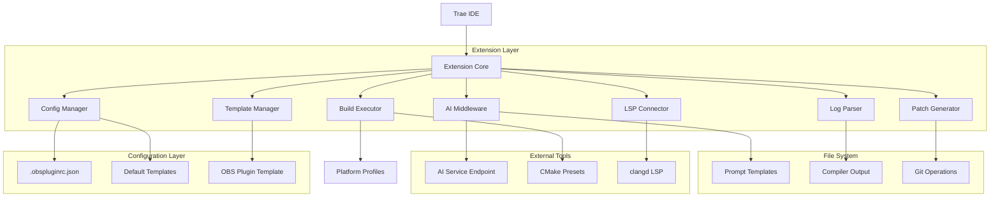
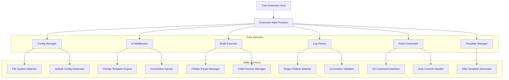
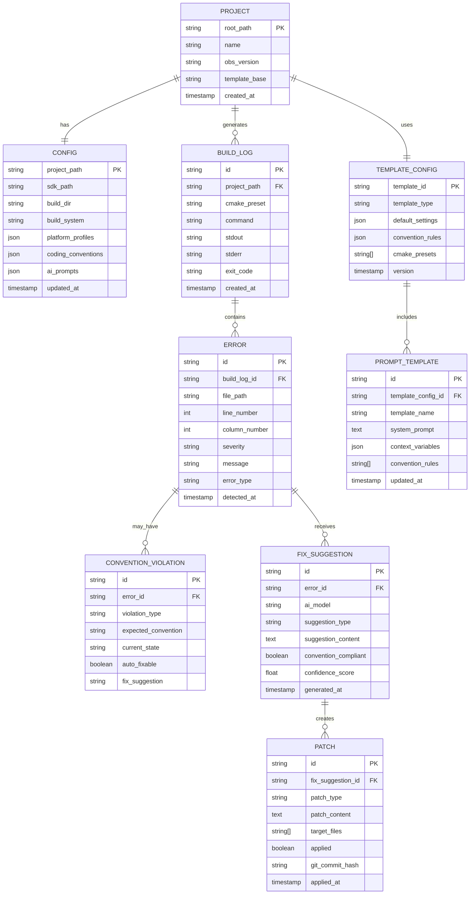

# OBS Plugin AI Assistant Extension - Technical Architecture Document

## 1. Architecture Design



## 2. Technology Description

- **Frontend**: TypeScript + Trae Extension API + Node.js runtime
- **Build System Integration**: CMake presets, Ninja, MSBuild (platform-specific)
- **Language Server**: clangd integration for C++ intelligence
- **Version Control**: Git integration for patch management and auto-commit
- **Configuration**: JSON schema validation for .obspluginrc.json with OBS template defaults
- **Template System**: Pre-configured OBS plugin development conventions and AI prompts

## 3. Route Definitions

| Route | Purpose |
|-------|---------|
| obs.configure | Configure CMake build system using platform-specific presets |
| obs.build | Execute CMake preset build with real-time output streaming |
| obs.clean | Clean build artifacts and reset build state |
| obs.fix-error | Send current errors to AI for automated fix suggestions with conventions |
| obs.show-config | Display parsed .obspluginrc.json configuration with defaults |
| obs.init-template | Generate default .obspluginrc.json with OBS plugin conventions |
| obs.run-tests | Execute unit tests if available in project |
| obs.commit | Auto-commit with English comments after successful build |

## 4. API Definitions

### 4.1 Core API

**Configuration Management**
```typescript
interface ObsConfig {
  sdk_path: string;
  build_dir: string;
  build_system: 'cmake' | 'meson' | 'make';
  plugin_entry: string;
  platform_profiles: Record<string, PlatformProfile>;
  dependencies?: Record<string, string>;
  coding_conventions: CodingConventions;
  ai_prompts: AIPromptConfig;
}

interface PlatformProfile {
  cmake_preset: string;
  build_command: string;
  configure_command: string;
  output_dir: string;
  compiler: string;
}

interface CodingConventions {
  header_extension: string;
  use_pragma_once: boolean;
  ui_components_dir: string;
  qt6_moc_include: boolean;
  english_comments: boolean;
  auto_commit: boolean;
}

interface AIPromptConfig {
  system_template: string;
  include_conventions: boolean;
  include_project_structure: boolean;
  include_recent_errors: boolean;
}
```

**AI Request Envelope**
```typescript
interface AIRequestEnvelope {
  intent: 'compile' | 'fix' | 'assist';
  system_prompt: string;
  user_prompt: string;
  file_contexts: FileContext[];
  recent_build_log?: string;
  coding_conventions: CodingConventions;
  project_structure: ProjectStructure;
}

interface FileContext {
  path: string;
  snippet: string;
  cursor_line: number;
  file_type: 'hpp' | 'cpp' | 'ui' | 'cmake';
}

interface ProjectStructure {
  base_template: 'obs-plugintemplate';
  ui_components_dir: string;
  deps_dir: string;
  build_dirs: string[];
  cmake_presets: string[];
}
```

**Error Representation**
```typescript
interface BuildError {
  file: string;
  line: number;
  column: number;
  severity: 'error' | 'warning' | 'info';
  message: string;
  raw: string;
  convention_violation?: ConventionViolation;
}

interface ConventionViolation {
  type: 'missing_pragma_once' | 'wrong_header_extension' | 'ui_component_location' | 'moc_include_missing';
  suggestion: string;
  auto_fixable: boolean;
}

interface ErrorCollection {
  errors: BuildError[];
  timestamp: string;
  build_command: string;
  cmake_preset: string;
}
```

**Patch Operations**
```typescript
interface PatchOperation {
  type: 'unified_diff' | 'edit_instructions';
  content: string;
  target_files: string[];
  validation_status: 'valid' | 'invalid' | 'pending';
  convention_compliance: boolean;
  auto_commit: boolean;
}

interface TemplateGeneration {
  template_type: 'config' | 'ui_component' | 'cmake_preset';
  target_path: string;
  conventions_applied: string[];
  generated_content: string;
}
```

## 5. Server Architecture Diagram



## 6. Data Model

### 6.1 Data Model Definition



### 6.2 Data Definition Language

**Configuration Table (config)**
```sql
-- Configuration storage for OBS plugin projects
CREATE TABLE config (
    project_path VARCHAR(500) PRIMARY KEY,
    sdk_path VARCHAR(500) NOT NULL DEFAULT '.deps/obs-studio',
    build_dir VARCHAR(100) NOT NULL DEFAULT 'build_macos',
    build_system VARCHAR(20) NOT NULL DEFAULT 'cmake',
    plugin_entry VARCHAR(200) NOT NULL DEFAULT 'src/plugin.cpp',
    platform_profiles JSON NOT NULL,
    dependencies JSON,
    coding_conventions JSON NOT NULL,
    ai_prompts JSON NOT NULL,
    created_at TIMESTAMP DEFAULT NOW(),
    updated_at TIMESTAMP DEFAULT NOW()
);

-- Index for faster project lookups
CREATE INDEX idx_config_project_path ON config(project_path);
CREATE INDEX idx_config_updated_at ON config(updated_at DESC);
```

**Template Configuration Table (template_config)**
```sql
-- Default template configurations for OBS plugin development
CREATE TABLE template_config (
    template_id VARCHAR(50) PRIMARY KEY,
    template_type VARCHAR(30) NOT NULL,
    template_name VARCHAR(100) NOT NULL,
    default_settings JSON NOT NULL,
    convention_rules JSON NOT NULL,
    cmake_presets JSON NOT NULL,
    version VARCHAR(20) NOT NULL,
    created_at TIMESTAMP DEFAULT NOW(),
    updated_at TIMESTAMP DEFAULT NOW()
);

-- Initial template data
INSERT INTO template_config (template_id, template_type, template_name, default_settings, convention_rules, cmake_presets, version) VALUES
('obs_plugin_default', 'project', 'OBS Plugin Default Template', 
 '{
    "sdk_path": ".deps/obs-studio",
    "build_dir": "build_macos",
    "build_system": "cmake",
    "plugin_entry": "src/plugin.cpp"
  }',
 '{
    "header_extension": ".hpp",
    "use_pragma_once": true,
    "ui_components_dir": "ui",
    "qt6_moc_include": true,
    "english_comments": true,
    "auto_commit": true
  }',
 '["macos", "windows-x64"]',
 '1.0.0');
```

**Build Log Table (build_log)**
```sql
-- Build execution logs with CMake preset information
CREATE TABLE build_log (
    id UUID PRIMARY KEY DEFAULT gen_random_uuid(),
    project_path VARCHAR(500) NOT NULL,
    cmake_preset VARCHAR(50) NOT NULL,
    command TEXT NOT NULL,
    stdout TEXT,
    stderr TEXT,
    exit_code INTEGER NOT NULL,
    duration_ms INTEGER,
    created_at TIMESTAMP DEFAULT NOW()
);

-- Indexes for build log queries
CREATE INDEX idx_build_log_project_path ON build_log(project_path);
CREATE INDEX idx_build_log_created_at ON build_log(created_at DESC);
CREATE INDEX idx_build_log_cmake_preset ON build_log(cmake_preset);
CREATE INDEX idx_build_log_exit_code ON build_log(exit_code);
```

**Error Table (error)**
```sql
-- Parsed compiler/linker errors with convention violation detection
CREATE TABLE error (
    id UUID PRIMARY KEY DEFAULT gen_random_uuid(),
    build_log_id UUID NOT NULL REFERENCES build_log(id),
    file_path VARCHAR(500) NOT NULL,
    line_number INTEGER,
    column_number INTEGER,
    severity VARCHAR(20) NOT NULL,
    message TEXT NOT NULL,
    error_type VARCHAR(50),
    convention_violation_type VARCHAR(50),
    auto_fixable BOOLEAN DEFAULT FALSE,
    detected_at TIMESTAMP DEFAULT NOW()
);

-- Indexes for error analysis
CREATE INDEX idx_error_build_log_id ON error(build_log_id);
CREATE INDEX idx_error_file_path ON error(file_path);
CREATE INDEX idx_error_severity ON error(severity);
CREATE INDEX idx_error_convention_violation ON error(convention_violation_type);
```

**Prompt Template Table (prompt_template)**
```sql
-- AI prompt templates with OBS plugin conventions
CREATE TABLE prompt_template (
    id UUID PRIMARY KEY DEFAULT gen_random_uuid(),
    template_name VARCHAR(100) NOT NULL,
    template_type VARCHAR(30) NOT NULL,
    system_prompt TEXT NOT NULL,
    context_variables JSON,
    convention_rules JSON NOT NULL,
    usage_count INTEGER DEFAULT 0,
    created_at TIMESTAMP DEFAULT NOW(),
    updated_at TIMESTAMP DEFAULT NOW()
);

-- Initial prompt templates
INSERT INTO prompt_template (template_name, template_type, system_prompt, context_variables, convention_rules) VALUES
('obs_plugin_expert', 'system', 
 'You are an expert C++ developer specializing in OBS Studio plugin development. This project follows OBS plugin template conventions with the following standards:

- Use .hpp extensions for headers with #pragma once
- Implement UI components as separate classes in ui/ directory  
- For Qt6 signals, include "moc_ClassName.cpp" in cpp files
- Use CMake presets: cmake --preset {cmake_preset}, cmake --build --preset {cmake_preset} --config Debug
- Dependencies are in .deps/ directory, build output in {build_dir}/
- Follow OBS API best practices and libobs conventions
- Write English comments and commit messages
- Avoid modifying CMakeLists.txt except for src file changes

When suggesting code changes, ensure compliance with these conventions and return precise file paths with line edits or unified diffs.',
 '{"cmake_preset": "macos", "build_dir": "build_macos", "deps_dir": ".deps"}',
 '{"header_extension": ".hpp", "pragma_once": true, "ui_dir": "ui", "qt6_moc": true, "english_comments": true}'),

('obs_error_fix', 'error_analysis',
 'Analyzing OBS plugin build error. Project uses CMake presets with Qt6 enabled. Common issues include:
- Missing #pragma once in .hpp files
- Incorrect moc file inclusion for Qt6 signals
- UI components not properly separated into ui/ directory
- Dependency path issues in .deps/ directory

Provide fixes that maintain OBS plugin template structure and coding conventions.

Error context: {error_message}
File: {file_path}:{line_number}
Build command: {build_command}',
 '{"error_message": "", "file_path": "", "line_number": 0, "build_command": ""}',
 '{"maintain_structure": true, "follow_conventions": true, "cmake_preset_aware": true}');
```

## 7. Default Configuration Schema

### 7.1 .obspluginrc.json Schema

```json
{
  "$schema": "http://json-schema.org/draft-07/schema#",
  "title": "OBS Plugin Configuration",
  "type": "object",
  "required": ["sdk_path", "build_system", "plugin_entry"],
  "properties": {
    "sdk_path": {
      "type": "string",
      "description": "Path to OBS Studio SDK",
      "default": ".deps/obs-studio"
    },
    "build_dir": {
      "type": "string", 
      "description": "Build output directory",
      "default": "build_macos"
    },
    "build_system": {
      "type": "string",
      "enum": ["cmake", "meson", "make"],
      "default": "cmake"
    },
    "plugin_entry": {
      "type": "string",
      "description": "Main plugin source file",
      "default": "src/plugin.cpp"
    },
    "platform_profiles": {
      "type": "object",
      "properties": {
        "macos": {
          "$ref": "#/definitions/platform_profile"
        },
        "windows": {
          "$ref": "#/definitions/platform_profile"
        }
      }
    },
    "dependencies": {
      "type": "object",
      "additionalProperties": {
        "type": "string"
      }
    },
    "coding_conventions": {
      "$ref": "#/definitions/coding_conventions"
    },
    "ai_prompts": {
      "$ref": "#/definitions/ai_prompt_config"
    }
  },
  "definitions": {
    "platform_profile": {
      "type": "object",
      "required": ["cmake_preset", "build_command"],
      "properties": {
        "cmake_preset": {
          "type": "string",
          "description": "CMake preset name"
        },
        "build_command": {
          "type": "string",
          "description": "Build command using preset"
        },
        "configure_command": {
          "type": "string",
          "description": "Configure command using preset"
        },
        "output_dir": {
          "type": "string",
          "description": "Platform-specific output directory"
        },
        "compiler": {
          "type": "string",
          "description": "Compiler toolchain"
        }
      }
    },
    "coding_conventions": {
      "type": "object",
      "properties": {
        "header_extension": {
          "type": "string",
          "default": ".hpp"
        },
        "use_pragma_once": {
          "type": "boolean",
          "default": true
        },
        "ui_components_dir": {
          "type": "string",
          "default": "ui"
        },
        "qt6_moc_include": {
          "type": "boolean",
          "default": true
        },
        "english_comments": {
          "type": "boolean",
          "default": true
        },
        "auto_commit": {
          "type": "boolean",
          "default": true
        }
      }
    },
    "ai_prompt_config": {
      "type": "object",
      "properties": {
        "system_template": {
          "type": "string",
          "default": "obs_plugin_expert"
        },
        "include_conventions": {
          "type": "boolean",
          "default": true
        },
        "include_project_structure": {
          "type": "boolean",
          "default": true
        },
        "include_recent_errors": {
          "type": "boolean",
          "default": true
        }
      }
    }
  }
}
```

### 7.2 CMake Preset Integration

The extension integrates with CMake presets defined in the OBS plugin template:

```json
{
  "version": 3,
  "configurePresets": [
    {
      "name": "macos",
      "displayName": "macOS",
      "generator": "Ninja",
      "binaryDir": "${sourceDir}/build_macos",
      "cacheVariables": {
        "CMAKE_BUILD_TYPE": "Debug",
        "CMAKE_OSX_ARCHITECTURES": "x86_64;arm64"
      }
    },
    {
      "name": "windows-x64",
      "displayName": "Windows x64",
      "generator": "Visual Studio 17 2022",
      "architecture": "x64",
      "binaryDir": "${sourceDir}/build_windows"
    }
  ],
  "buildPresets": [
    {
      "name": "macos",
      "configurePreset": "macos",
      "configuration": "Debug"
    },
    {
      "name": "windows-x64",
      "configurePreset": "windows-x64",
      "configuration": "Debug"
    }
  ]
}
```